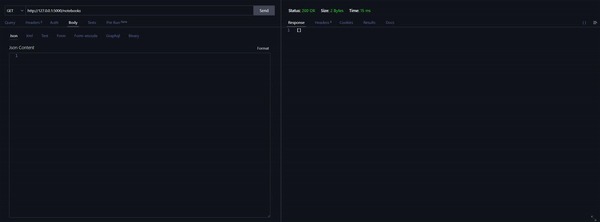

# Web Scraper API

Api RESTful desenvolvida a partir de dados providos por um crawler que faz uma raspagem de dados do https://webscraper.io/test-sites/e-commerce/allinone, que é utilizado para testes de web scraping, que simula uma pequena lista de amostra de aparelhos eletrônicos.

O crawler está configurado para obter os dados de notebooks da marca lenovo e os ordena do preço mais barato para o mais caro.



## O desafio é:

* Acessar esse site https://webscraper.io/test-sites/e-commerce/allinone
* Pegar todos notebooks Lenovo ordenando do mais barato para o mais caro.
* Pegar todos os dados disponíveis dos produtos.
* Os dados obtidos pelo robô devem ser consumido por uma pequena RESTFul API JSON para deixar mais otimizado.

## Stacks utilizadas

* [Python](https://www.python.org/)
* [Git](https://git-scm.com/)
* [Docker](https://www.docker.com/)
* [Flask](https://flask.palletsprojects.com/en/2.2.x/)
* [Flask-RESTful](https://flask-restful.readthedocs.io/en/latest/)
* [MongoDB](https://www.mongodb.com/)
* [PyMongo](https://pymongo.readthedocs.io/en/stable/)
* [Flask-PyMongo](https://flask-pymongo.readthedocs.io/en/latest/)
* [Playwright](https://playwright.dev/python/docs/library)
* [PyTest](https://docs.pytest.org/en/7.1.x/contents.html)

## Requisitos para instalar e rodar aplicação

* [Git](https://git-scm.com/)
* [Docker](https://www.docker.com/) com o plug-in do [Docker Compose](https://docs.docker.com/compose/install/) instalado. Caso tenha alguma dificuldade sugiro procurar as respectivas documentações clicando nos links. :wink:
* [MongoDB](https://www.mongodb.com/) * caso queira utilizar sem docker.
* Um cliente de API como [Insomnia](https://insomnia.rest/) ou [Postman](https://www.postman.com/).


## Variáveis de Ambiente

Caso opte por rodar o projeto `sem o docker` é necessário configurar as `variáveis de ambiente`;

```env
MONGODB_URI=MONGODB_URI=mongodb://<user>:<password>@localhost:27017/webscraper **Caso não possua autenticação basta remover o "<user>:<password>@"
FLASK_APP=webscraper_api/server.py ***Não mudar
```

## Instalação

Primeiramente baixe a aplicação. Em seu terminal insira o seguinte comando:

```bash
git clone git@github.com:dihsantanna/webscraper_dev_api.git && cd webscraper_dev_api
```

<hr>

### `Com docker`

  Com o docker devidamente instalado e habilitado, digite no seu terminal:

  ```bash
  docker-compose up -d --build
  ```

  *Este processo pode demorar alguns minutos dependendo de sua velocidade de internet.

  Pronto! Sua aplicação já pode ser utilizada e a API estará rodando no http://127.0.0.1:5000/, mas o banco de dados ainda não foi populado e para fazer isso insira o comando:

  ```bash
  docker container exec -it webscraper_api bash -c "python scrape_init.py"
  ```

  *Esse comando serve para iniciar a raspagem de dados inicial, aguarde até o término dela.

<hr>

### `Sem docker`

  É aconselhável criar em aplicações python criar um ambiente virtual para isso basta usar o comando abaixo:

  Windows
  ```bash
  python -m venv .venv && . .\.venv\Scripts\activate
  ```

  Linux e MacOs
  ```bash
  python -m venv .venv && source .venv/bin/activate
  ```

  Agora remova o sufixo `.example` do arquivo `.env.example` e configure as variáveis de ambiente. Com as variáveis de ambiente configuradas execute o comando abaixo para instalar dependencias:

  ```bash
  pip install -r requirements.txt
  ```

  Agora temos que popular o banco de dados para isso use o comando:

  ```bash
  python scrape_init.py
  ```

  *Esse comando serve para iniciar a raspagem de dados inicial, aguarde até o término dela.

  Agora é hora de iniciarmos a API, para isso use o comando:

  ```bash
  python -m flask run --host=0.0.0.0
  ```


## Parando a aplicação

Após utilizar a aplicação caso queira parar a execução da aplicação basta inserir o seguinte comando no terminal:

com docker:
```bash
docker-compose down --remove-orphans
```
sem docker: `"Basta dar um CTR+C no terminal"` :smile:
## Usando a API

Abra o seu cliente de API. ([Insominia](https://insomnia.rest/) ou [Postman](https://www.postman.com/))

A API possui duas rotas a `/notebooks` e `/scraper`(que também pode ser utilizada com a query `orderId`),
ambas possuem método `GET`, porém só a `/scraper` possui método `POST` utilizando a query `orderId`.

### Rota GET `/notebooks`

Retorna todos os notebooks encontrados pelo scraper salvos no banco de dados, ordenados do menor para o maior preço.

O resultado é parecido com os dados abaixo:

`STATUS CODE 200`
```json
[
	{
		"_id": {
			"$oid": "630e2df74dcb1ccc11a4ed6c"
		},
		"title": "Lenovo V110-15IAP",
		"description": "Lenovo V110-15IAP, 15.6\" HD, Celeron N3350 1.1GHz, 4GB, 128GB SSD, Windows 10 Home",
		"img_src": "https://webscraper.io/images/test-sites/e-commerce/items/cart2.png",
		"price_for_hdd": {
			"128": {
				"price": 321.94
			},
			"256": {
				"price": 341.94
			},
			"512": {
				"price": 361.94
			}
		},
		"rating": {
			"qty_reviews": 5,
			"qty_stars": 3
		}
	},
	{
		"_id": {
			"$oid": "630e2df74dcb1ccc11a4ed6d"
		},
		"title": "Lenovo V110-15IAP",
		"description": "Asus VivoBook 15 X540NA-GQ008T Chocolate Black, 15.6\" HD, Pentium N4200, 4GB, 500GB, Windows 10 Home, En kbd",
		"img_src": "https://webscraper.io/images/test-sites/e-commerce/items/cart2.png",
		"price_for_hdd": {
			"128": {
				"price": 356.49
			},
			"256": {
				"price": 376.49
			},
			"512": {
				"price": 396.49
			}
		},
		"rating": {
			"qty_reviews": 6,
			"qty_stars": 2
		}
	},
	{
		"_id": {
			"$oid": "630e2df74dcb1ccc11a4ed6e"
		},
		"title": "Lenovo ThinkPad E31-80",
		"description": "Lenovo ThinkPad E31-80, 13.3\" HD, Celeron 3855U 1.6GHz, 4GB, 128GB SSD, Windows 10 Home",
		"img_src": "https://webscraper.io/images/test-sites/e-commerce/items/cart2.png",
		"price_for_hdd": {
			"128": {
				"price": 404.23
			},
			"256": {
				"price": 424.23
			},
			"512": {
				"price": 444.23
			}
		},
		"rating": {
			"qty_reviews": 12,
			"qty_stars": 1
		}
	},
  {...}
]
```

### Rota POST `/scrape`

Essa rota é responsável por enviar uma ordem de raspagem de dados ao scraper.

É retornada uma mensagem, com o `orderId` que pode ser utilizado para verificar se a raspagem já foi concluída.

`STATUS CODE 201`
```json
{
  "message": "Scrape order created!",
  "order_id": "63017ec05c1c2fc9080d35d0"
}
```

### Rota GET `/scrape?orderId=<order_id>`

Essa rota é responsável por verificar o andamento da solicitação de scraping. Existe a possibilidade de dois retornos.

Raspagem de dados ainda `não` foi concluída:

`STATUS CODE 200`
```json
{
  "message": "Scraping order is not completed"
}
```

Raspagem de dados concluída:

`STATUS CODE 200`
```json
{
  "message": "Scraping order already completed"
}
```
## Rodando os testes

Para rodar os testes, rode o seguinte comando

com docker
```bash
docker container exec -it webscraper_api bash -c "pytest ./tests --verbose"
```

sem docker
```bash
pytest ./tests --verbose
```

Ao todo a aplicação possui `60%` de cobertura de testes.

Caso queira ver a cobertura de testes rode o comando

com docker
```bash
docker container exec -it webscraper_api bash -c "pytest --cov=webscraper_api tests/"
```

sem docker
```bash
pytest --cov=webscraper_api tests/
```


## Aprendizados

Aprendi a utilizar a ferramenta `Playwright` para a realização do web scraper,
além de poder ter exercitado meus conhecimentos de `Python` e construção de `APIs RESTful` utilizando `Flask`.

Pude melhorar meu conhecimento na construção de APIs providas por banco de dados não relacional, no caso o mongoDB,
principalmente utilizando o python, pois geralmente utilizo o `nodeJS` para essas tarefas. Coloquei isso como desafio pessoal.

Algo que gostei bastante foi da utilização do `Playwright` que facilita em muito o scraping, principalmente se comparar ao que utilizava.
(`parsel` + `requests`).

Algo que tive um pouco de dificuldade foi no momento de testar a aplicação, por isso não completei 100% de cobertura e parei nos 60%.
Mas foi bom pois melhorei os meus conhecimentos com o pytest, e configuração de mocks para aplicações com Flask, e me desafiei em entregar
ao menos 50% de cobertura.
